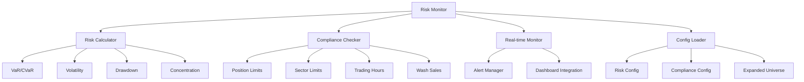

# Risk Compliance System

## Overview

The Risk Compliance System provides real-time risk monitoring and compliance checking for trading operations. It monitors portfolio risk metrics, enforces trading compliance rules, and generates alerts when limits are breached.

## Features

### Risk Monitoring
- **Value at Risk (VaR)** calculation at 95% and 99% confidence levels
- **Conditional VaR (CVaR)** for tail risk assessment
- **Portfolio volatility** and **maximum drawdown** monitoring
- **Concentration risk** analysis
- **Position size limits** enforcement
- **Stress testing** capabilities

### Compliance Checking
- **Position size limits** per security
- **Sector concentration** limits
- **Daily turnover** limits
- **Wash sale** detection
- **Short selling** restrictions
- **Leverage** limits
- **Trading hours** compliance

### Real-time Monitoring
- Continuous risk limit monitoring
- Automated alert generation
- Integration with monitoring dashboard
- Risk report generation

## Architecture



## Installation

1. **Install Dependencies:**
   ```bash
   cd /path/to/risk-compliance
   pip install -r requirements.txt
   ```

2. **Install Package (Optional):**
   ```bash
   pip install -e .
   ```

## Configuration

### Risk Limits Configuration
Edit `config/risk_config.yaml` to configure risk limits:

```yaml
risk_limits:
  portfolio_var_95:
    limit_type: "var_95"
    threshold: -0.05
    severity: "WARNING"
    enabled: true
```

### Compliance Rules Configuration
Edit `config/compliance_config.yaml` to configure compliance rules:

```yaml
compliance_rules:
  position_limit:
    rule_type: "position_size"
    parameters:
      max_position_pct: 0.05
    severity: "ERROR"
    enabled: true
```

## Usage

### Command Line Interface

1. **Start Real-time Monitoring:**
   ```bash
   python bin/risk_monitor.py
   ```

2. **Run Test Cycle:**
   ```bash
   python bin/risk_monitor.py --test
   ```

3. **Generate Risk Report:**
   ```bash
   python bin/risk_monitor.py --report
   ```

4. **Enable Debug Logging:**
   ```bash
   python bin/risk_monitor.py --debug
   ```

### Python API

```python
from risk_compliance import RiskCalculator, RealTimeRiskMonitor, ComplianceChecker

# Initialize components
risk_calc = RiskCalculator()
monitor = RealTimeRiskMonitor()
compliance = ComplianceChecker()

# Calculate risk metrics
positions = {"RELIANCE": 100000, "TCS": 50000}
returns_data = {...}  # Historical returns
risk_metrics = risk_calc.calculate_portfolio_risk(positions, returns_data)

# Check risk limits
alerts = monitor.check_portfolio_risk(positions, returns_data)

# Check compliance
trade_order = {"symbol": "INFY", "quantity": 1000}
violations = compliance.check_trade_compliance(trade_order, positions)
```

## Integration

### With Trading Execution Engine
The risk monitor integrates with the trading execution engine to:
- Receive real-time portfolio data
- Send risk alerts
- Block non-compliant trades

### With Monitoring Dashboard
Risk data is sent to the monitoring dashboard for:
- Real-time visualization
- Historical trend analysis
- Alert management

### With Strategy Engine
Compliance checks are performed on:
- Strategy signals before execution
- Portfolio rebalancing operations
- Risk-adjusted position sizing

## Data Sources

### Expanded Universe
- Uses `expanded_universe.json` with 243+ Indian stocks
- Supports multiple market segments (Nifty 50, Next 50, Midcap, Smallcap)
- Configuration-driven ticker selection

### Historical Data
- Daily returns for risk calculations
- Price data for compliance checks
- Integration with BigQuery and local files

## Files and Directories

### Core Files
- `bin/risk_monitor.py` - Main risk monitoring service
- `src/risk_compliance/` - Core modules
- `config/` - Configuration files
- `tests/` - Unit and integration tests

### Configuration Files
- `config/risk_config.yaml` - Risk limits configuration
- `config/compliance_config.yaml` - Compliance rules
- `config/monitoring_config.yaml` - General monitoring settings
- `config/expanded_universe.json` - Trading universe

### Generated Files
- `logs/` - Log files with timestamps
- `data/` - Runtime data files
- `reports/` - Generated risk reports

## Support

For technical support or questions:
1. Check the logs in `logs/` directory
2. Review configuration files
3. Run with `--debug` flag for detailed logging
4. Check integration with other services

## License

This project is part of the AI Trading Machine system.
Licensed by SJ Trading.
risk-report --config config/risk_config.yaml --date 2023-07-18
```

See documentation for more details.
