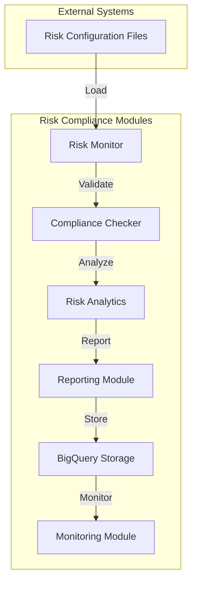

# Risk Compliance Quick Start Guide

## Step-by-Step Execution Guide

### 1. Initial Setup (5 minutes)

```bash
# Navigate to risk-compliance directory
cd /Users/sivarajumalladi/Documents/GitHub/risk-compliance

# Verify dependencies are installed
pip install -r requirements.txt

# Check if service is working
python bin/risk_monitor.py --help
```

Expected output:
```
usage: risk_monitor.py [-h] [--report] [--test] [--debug]
AI Trading Machine Risk Monitor
```

### 2. Configuration Review (5 minutes)

**Check risk limits configuration:**
```bash
cat config/risk_config.yaml
```

**Check compliance rules:**
```bash
cat config/compliance_config.yaml
```

**Verify expanded universe is loaded:**
```bash
head -20 config/expanded_universe.json
```

### 3. Test Risk Monitor (2 minutes)

```bash
# Run a quick test cycle
python bin/risk_monitor.py --test
```

Expected output:
```
INFO - Loaded expanded universe with 243 tickers
WARNING - No positions found in portfolio data
✅ Test monitoring cycle completed
```

### 4. Generate Risk Report (2 minutes)

```bash
# Generate a comprehensive risk report
python bin/risk_monitor.py --report
```

This will create a risk report and show portfolio metrics.

### 5. Enable Debug Mode (Optional)

```bash
# Run with detailed logging
python bin/risk_monitor.py --debug --test
```

## Quick API Usage

### Basic Risk Calculation

```python
#!/usr/bin/env python3
"""
Quick risk calculation example
"""
import sys
from pathlib import Path
import pandas as pd
import numpy as np

# Add the src directory to Python path
sys.path.insert(0, str(Path(__file__).parent / "src"))

from risk_compliance import RiskCalculator, ConfigLoader

# Initialize
calc = RiskCalculator()
config = ConfigLoader()

# Sample portfolio positions (in ₹)
positions = {
    "RELIANCE": 500000,    # ₹5 lakh in Reliance
    "TCS": 300000,         # ₹3 lakh in TCS
    "INFY": 200000,        # ₹2 lakh in Infosys
    "HDFCBANK": 400000,    # ₹4 lakh in HDFC Bank
    "ICICIBANK": 150000    # ₹1.5 lakh in ICICI Bank
}

# Generate sample returns (in practice, get from data pipeline)
def generate_sample_returns(symbols, days=252):
    """Generate sample historical returns"""
    returns_data = {}
    dates = pd.date_range(start='2023-01-01', periods=days, freq='D')
    
    for symbol in symbols:
        # Random returns with different characteristics per symbol
        np.random.seed(hash(symbol) % 1000)
        returns = np.random.normal(0.001, 0.02, days)  # 0.1% daily mean, 2% volatility
        returns_data[symbol] = pd.Series(returns, index=dates)
    
    return returns_data

# Calculate risk metrics
symbols = list(positions.keys())
returns_data = generate_sample_returns(symbols)
risk_metrics = calc.calculate_portfolio_risk(positions, returns_data)

# Display results
print("🎯 PORTFOLIO RISK ANALYSIS")
print("=" * 50)
print(f"💰 Total Portfolio Value: ₹{sum(positions.values()):,.2f}")
print(f"📊 Number of Positions: {len(positions)}")
print()
print("📈 RISK METRICS:")
for metric, value in risk_metrics.items():
    if isinstance(value, (int, float)):
        if 'var' in metric or 'drawdown' in metric:
            print(f"  {metric:20}: ₹{value:,.2f}")
        elif 'ratio' in metric:
            print(f"  {metric:20}: {value:.3f}")
        else:
            print(f"  {metric:20}: {value:.4f}")
```

Save this as `quick_test.py` and run:
```bash
python quick_test.py
```

### Real-time Monitoring Setup

```python
#!/usr/bin/env python3
"""
Real-time monitoring example
"""
import asyncio
from risk_compliance import RealTimeRiskMonitor, RiskLimit

async def setup_monitoring():
    monitor = RealTimeRiskMonitor()
    
    # Add custom risk limits
    custom_limits = [
        RiskLimit("daily_var", "var_95", -50000, "ERROR"),  # ₹50k daily VaR limit
        RiskLimit("portfolio_vol", "volatility", 0.20, "WARNING"),  # 20% volatility limit
        RiskLimit("max_position", "position_size", 0.15, "WARNING")  # 15% max position
    ]
    
    for limit in custom_limits:
        monitor.add_risk_limit(limit)
    
    print("✅ Risk monitoring configured")
    print(f"📊 Active limits: {len(monitor.risk_limits)}")
    
    # Add alert callback
    def alert_handler(alert):
        print(f"🚨 ALERT: {alert.message}")
    
    monitor.add_alert_callback(alert_handler)
    
    return monitor

# Run setup
if __name__ == "__main__":
    monitor = asyncio.run(setup_monitoring())
```

## Integration with Other Services

### 1. Trading Execution Engine Integration

The risk monitor automatically tries to connect to:
- **URL**: `http://localhost:8002/api/portfolio`
- **Purpose**: Get real-time portfolio data

### 2. Monitoring Dashboard Integration

Risk data is sent to:
- **URL**: `http://localhost:8000/api/alerts`
- **Purpose**: Display alerts and metrics

### 3. Data Pipeline Integration

Historical data is fetched from:
- **BigQuery**: Project `ai-trading-machine`, dataset `trading_data`
- **Local files**: `./data/` directory

## Common Commands

### Daily Operations

```bash
# 1. Morning risk check
python bin/risk_monitor.py --report

# 2. Start continuous monitoring
python bin/risk_monitor.py &

# 3. Check logs
tail -f logs/risk_compliance_$(date +%Y%m%d).log

# 4. Emergency stop
pkill -f risk_monitor.py
```

### Configuration Changes

```bash
# 1. Edit risk limits
nano config/risk_config.yaml

# 2. Edit compliance rules
nano config/compliance_config.yaml

# 3. Test configuration
python bin/risk_monitor.py --test --debug
```

### Troubleshooting

```bash
# 1. Check configuration files
python -c "from risk_compliance.utils.config_loader import ConfigLoader; c = ConfigLoader(); print('✅ Config OK')"

# 2. Test calculations
python -c "from risk_compliance import RiskCalculator; r = RiskCalculator(); print('✅ Calculator OK')"

# 3. Check universe loading
python -c "from risk_compliance.utils.config_loader import ConfigLoader; c = ConfigLoader(); u = c.load_expanded_universe(); print(f'✅ Universe: {len(u.get(\"universe\", {}).get(\"nifty_50\", []))} Nifty 50 stocks')"
```

## File Locations

### Important Paths
- **Main Script**: `bin/risk_monitor.py`
- **Configuration**: `config/`
- **Logs**: `logs/risk_compliance_YYYYMMDD.log`
- **Reports**: `reports/risk_report_YYYY-MM-DD.json`
- **Data**: `data/risk_monitoring.json`

### Configuration Files
- **Risk Limits**: `config/risk_config.yaml`
- **Compliance Rules**: `config/compliance_config.yaml`
- **Monitoring Settings**: `config/monitoring_config.yaml`
- **Trading Universe**: `config/expanded_universe.json`

## Next Steps

1. **Review and adjust risk limits** in `config/risk_config.yaml`
2. **Configure compliance rules** for your trading strategy
3. **Set up integration** with trading execution engine
4. **Configure alerting** (email, Slack, etc.)
5. **Schedule daily reports** using cron jobs

## Baby Steps for New Users

### Step 1: Understand the System (Day 1)
```bash
# Just look around, don't change anything
ls -la
cat README.md
python bin/risk_monitor.py --help
```

### Step 2: Test with Sample Data (Day 1)
```bash
# Run a simple test
python bin/risk_monitor.py --test
# Check what files were created
ls logs/ data/ reports/
```

### Step 3: Review Configuration (Day 2)
```bash
# Look at the config files
cat config/risk_config.yaml
cat config/compliance_config.yaml
# Understand what each parameter does
```

### Step 4: Generate Your First Report (Day 2)
```bash
# Create a risk report
python bin/risk_monitor.py --report
# Open and read the generated report
cat reports/risk_report_*.json
```

### Step 5: Customize for Your Needs (Day 3+)
```bash
# Modify risk limits based on your risk tolerance
nano config/risk_config.yaml
# Test your changes
python bin/risk_monitor.py --test --debug
```

This system is designed to be safe and informative. All checks are logged, and nothing will automatically block trades without your explicit configuration.

## Architecture Flow



### Explanation
- **Risk Configuration Files**: YAML files defining risk limits and compliance rules.
- **Risk Monitor**: Monitors real-time risk metrics.
- **Compliance Checker**: Validates compliance with SEBI regulations.
- **Risk Analytics**: Performs advanced risk calculations.
- **Reporting Module**: Generates compliance and risk reports.
- **BigQuery Storage**: Stores risk and compliance data.
- **Monitoring Module**: Tracks system performance and alerts.
